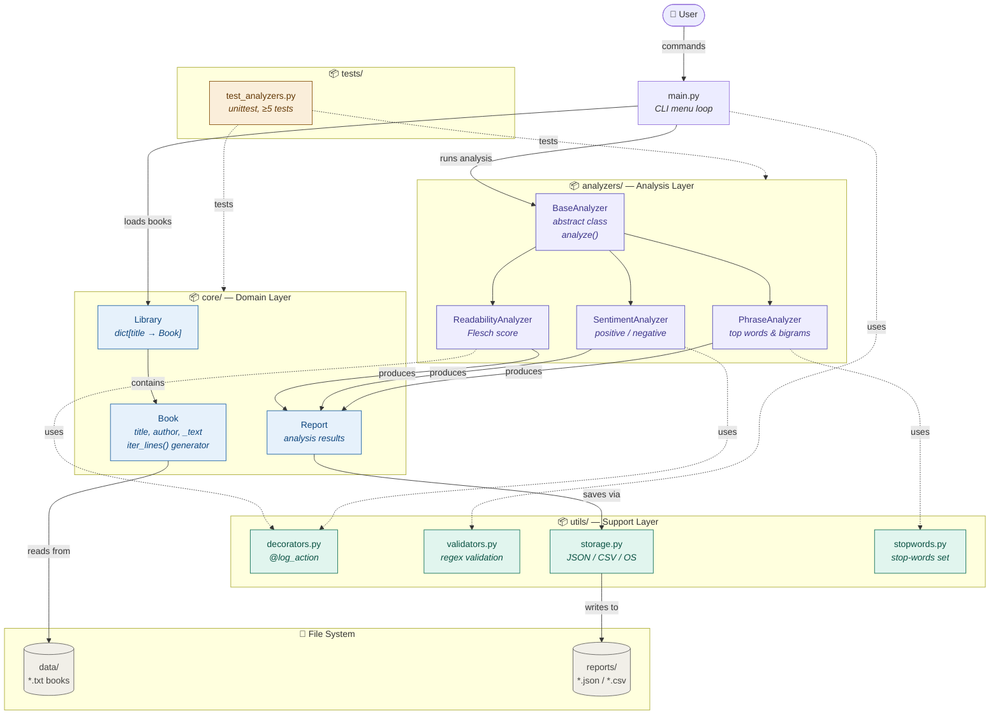

# Book Analyzer

A modular Python CLI tool that analyses plain-text books and produces three
kinds of insights: **readability** (Flesch), **sentiment** (lexicon-based)
and **top phrases** (unigrams + bigrams, stop-words filtered out).

The project uses only the Python **standard library** — there is nothing to
`pip install`.

---

## Architectural design



### Class hierarchy

```
BaseAnalyzer (abstract)              core.Book
    │                                    │
    ├── ReadabilityAnalyzer              │ has-many ▼
    ├── SentimentAnalyzer            core.Library
    └── PhraseAnalyzer                   │
                                         │ references ▼
                                     core.Report
```

* **Inheritance** — three concrete analyzers extend `BaseAnalyzer` and
  override the abstract `analyze(book)` method.
* **Polymorphism** — `main.py` builds a `list[BaseAnalyzer]` and iterates
  with a single `analyzer.analyze(book)` call regardless of subclass.
* **Association** — `Library` *has-many* `Book` (dict-keyed by title);
  `Report` *references* exactly one `Book`.
* **Encapsulation** — every domain attribute is prefixed with `_` and
  exposed (when needed) through `@property` getters.

---

## How to run

```
python main.py
```

Interactive menu:

```
=== Book Analyzer ===
1. Load a book from data/
2. List books in library
3. Analyze a book
4. View last report
5. Save report (JSON / CSV)
6. Load saved library state
0. Exit
```

For a non-interactive end-to-end demo (load `data/sample.txt`, run all
three analyzers, save JSON + CSV reports and the library state):

```
python main.py --demo
```

## How to test

From the project root:

```
python -m unittest discover tests -v
```

All 8 tests cover: Flesch math, sentiment polarity (+/–), phrase counting,
`Book.load()` and `iter_lines()`, regex filename validation, tokenizer /
sentence splitter, and `Report` serialisation.

---

## Individual contributions

| Member       | Lead module(s)                 | Responsibilities                                                                                  | Commits / PRs |
|--------------|--------------------------------|---------------------------------------------------------------------------------------------------|---------------|
| **Member 1** | `core/` + `utils/storage.py`   | `Book`, `Library`, `Report` classes; `iter_lines()` generator; JSON/CSV persistence layer.        | _add link_    |
| **Member 2** | `analyzers/` + `utils/stopwords.py` | `BaseAnalyzer` ABC and the three concrete analyzers; sentiment lexicon and stop-word set.    | _add link_    |
| **Member 3** | `main.py` + `utils/` + `tests/`     | CLI menu loop, `@log_action` decorator, regex validators, unit-test suite.                  | _add link_    |

---

## Sample output

Running `python main.py --demo` against `data/sample.txt` (Lewis Carroll,
*Alice in Wonderland*, opening of Chapter I, public domain):

```
[log_action] -> ReadabilityAnalyzer.analyze starting
[log_action] <- ReadabilityAnalyzer.analyze done in 0.0010s
[log_action] -> SentimentAnalyzer.analyze starting
[log_action] <- SentimentAnalyzer.analyze done in 0.0003s
[log_action] -> PhraseAnalyzer.analyze starting
[log_action] <- PhraseAnalyzer.analyze done in 0.0008s
Loaded: sample.txt by Lewis Carroll (550 words)

Report for sample.txt by Lewis Carroll
Created: 2026-05-02T16:48:46Z
------------------------------------------------
[Readability]
  score: 61.09
  interpretation: standard
  words: 550
  sentences: 17
  syllables: 734
[Sentiment]
  positive_count: 4
  negative_count: 2
  polarity: 0.333
  label: positive
  total_emotional_words: 6
[TopPhrases]
  top_words: [('alice', 7), ('rabbit', 7), ('well', 5), ('think', 4), ('time', 4), ...]
  top_bigrams: [('rabbit hole', 3), ('oh dear', 2), ('thought alice', 2), ...]
  unique_content_words: 158
  total_content_words: 227

Saved JSON -> reports/report_sample_txt_20260502T164846Z.json
Saved CSV  -> reports/report_sample_txt_20260502T164846Z.csv
Saved library state -> reports/library_state.json
```

---

## Grading-rubric coverage

| Section | Where it lives |
|---|---|
| CLI loop (`while`, `for`, `if/elif/else`, logical operators) | `main.py` |
| `list` / `tuple` / `set` / `dict` + `os` / `csv` / `json` persistence | `analyzers/phrases.py`, `utils/stopwords.py`, `core/library.py`, `utils/storage.py` |
| Encapsulation (`_attr` + `@property`) | `core/book.py`, `core/library.py`, `core/report.py` |
| Inheritance + Polymorphism | `analyzers/base.py` + 3 subclasses; `main.py::_run_analyzers` |
| Association | `Library` ↔ `Book`, `Report` ↔ `Book` |
| `lambda` / `map` / `filter` | `analyzers/phrases.py`, `analyzers/readability.py`, `analyzers/sentiment.py` |
| Decorator | `utils/decorators.py::log_action` applied to every `analyze()` |
| Generator | `core.Book.iter_lines()` |
| Regex | `utils/validators.py` (filename, words, sentences) |
| Unit tests | `tests/test_analyzers.py` (8 tests) |
| Docstrings + try/except | every public class/method in the project |
